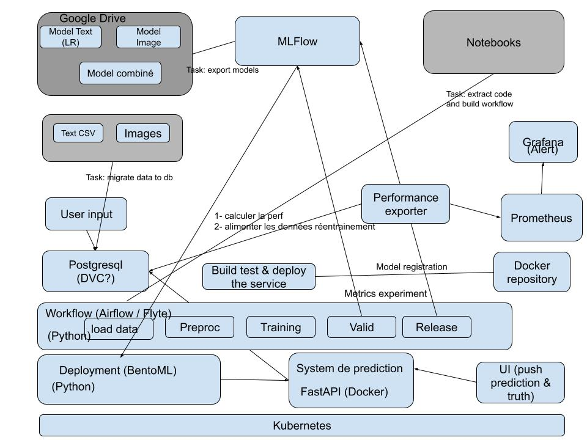

<h1 align="center">MLops: Rakuten prediction system for product categorisation</h1>

Short description of the project

## Design



## Installation

### Infra

Prerequisites:

* [Docker](https://docs.docker.com/get-docker/) and docker-compose
* [Minikube](https://minikube.sigs.k8s.io/docs/start/) or local Kubernetes cluster
* [Helm](https://helm.sh/docs/intro/install/)
``` bash
minikube start
```

* [Postgresql](https://phoenixnap.com/kb/postgresql-kubernetes)
* [Mlflow](https://github.com/bitnami/charts/tree/main/bitnami/mlflow)
* [Monitoring stack (Prometheus & Grafana)](https://medium.com/@brightband/deploying-prometheus-operator-to-a-kubernetes-cluster-c2378038c79b)
* [Private docker registry](https://hub.docker.com/r/ogouni604/mlops-rakuten) 
* [Minio](https://medium.com/@kapincev/easy-guide-setting-up-minio-with-microk8s-kubernetes-321048d901ac)

* [Flyte](https://github.com/davidmirror-ops/flyte-the-hard-way/blob/main/docs/on-premises/single-node/002-single-node-onprem-install.md)
``` bash
flytectl create project      
    --id "rakuten" \
    --description "Rakuten product category predictor" \
    --name "Rakuten"
```

## Usage

### Run the ML workflow

``` bash
pyflyte run --remote {path_to_workflow.py} {workflow_name}
```

### Build and deploy the ML service
``` bash
mlflow artifacts download --artifact-uri "models:/rakuten-pcat/{version}"  --dst-path model

docker build -t ogouni604/mlops-rakuten:{version} .

docker push ogouni604/mlops-rakuten:{version}

kubectl apply -f k8s-dep.yaml
```

## How it looks like


## References


